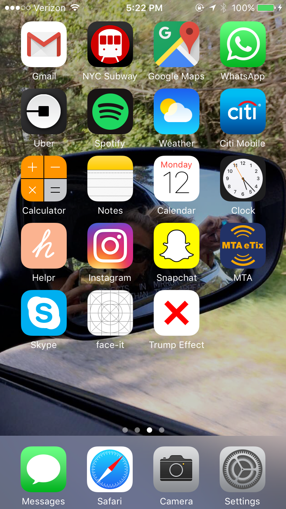
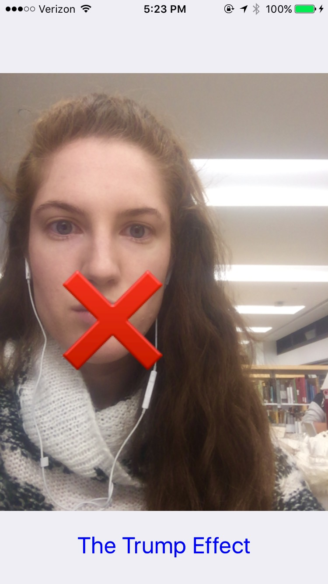

# The Trump Effect 

                        

The Trump Effect is a filter that uses mouth detection in the AVFoundation framework in swift. 

I created it to bring attention to a report that came out of the [Southern Poverty Law Center's Teacher Tolerance Project](https://www.splcenter.org/20161128/trump-effect-impact-2016-presidential-election-our-nations-schools) on the impact of Donald Trump's 2016 Presidenial campaign on U.S schools. 

I encourage you to read all about [The Trump Effect](https://www.splcenter.org/sites/default/files/splc_the_trump_effect.pdf).

------
This app was made with code created by Derek Andre for his face-it detection tutorial. He uses hearts to cover the users eyes. It's super fun. Check it out [here](https://keyholesoftware.com/2016/05/02/apple-face-detection-api/).  
